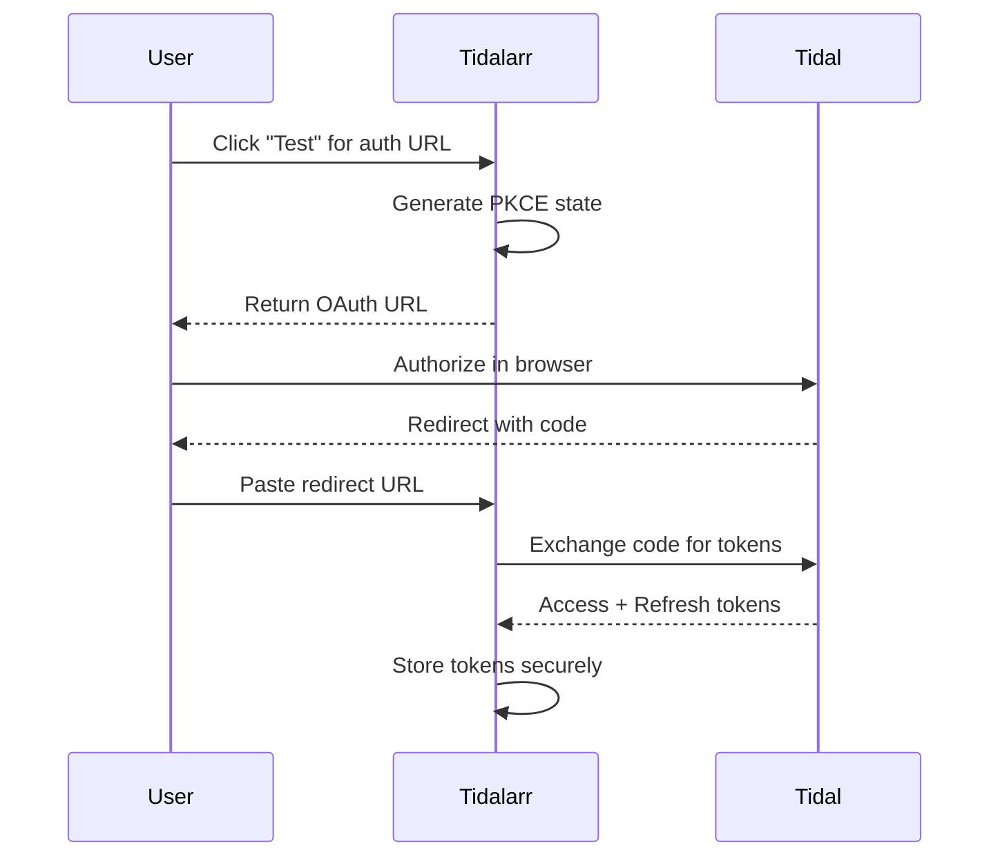
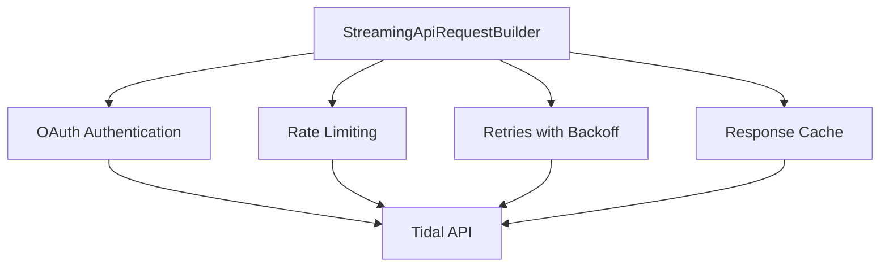
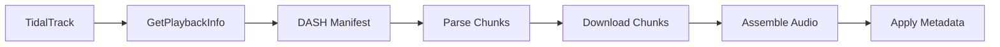
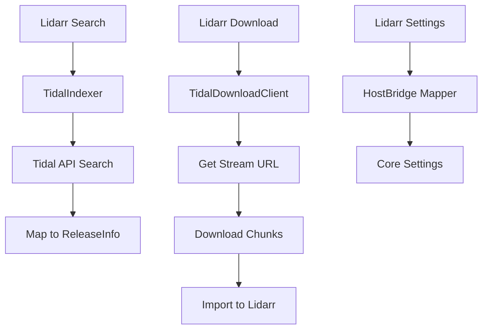
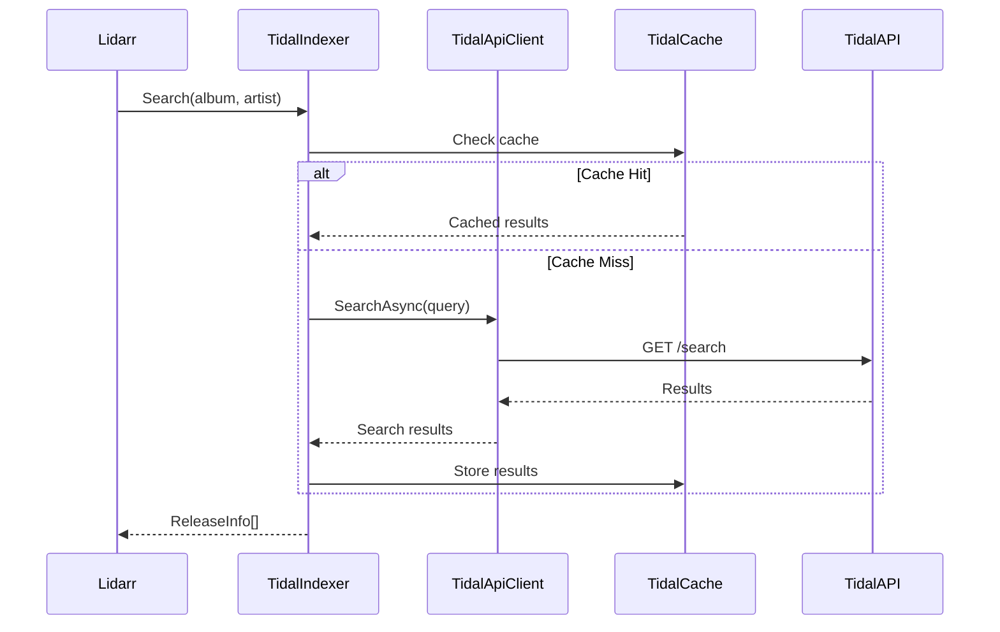
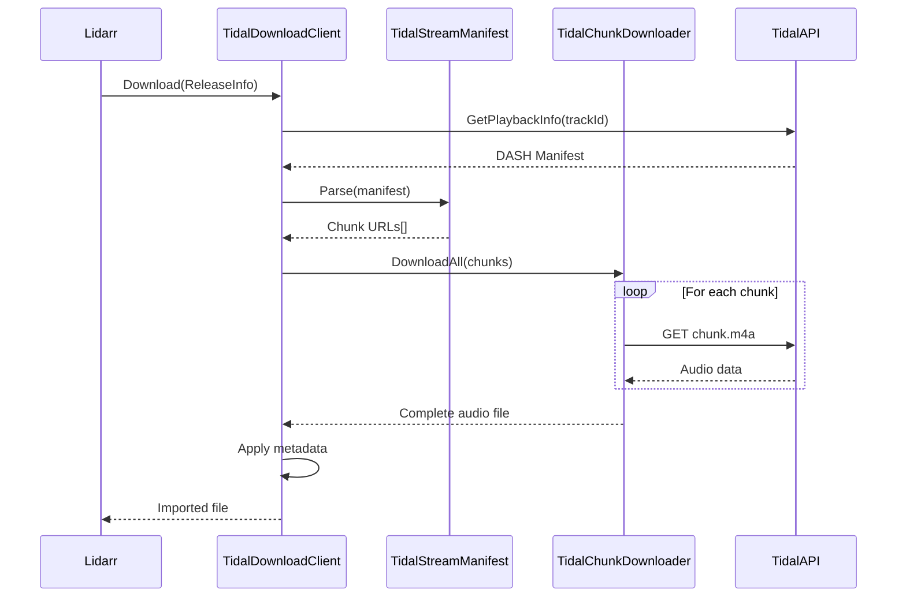
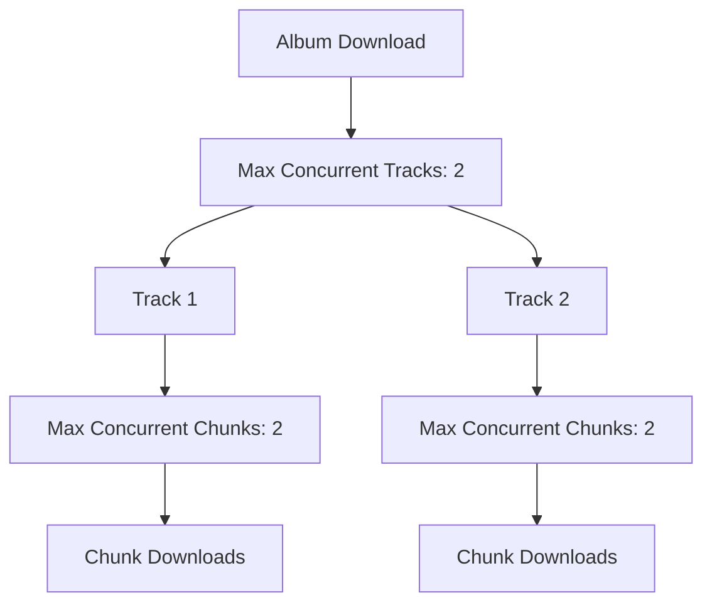

# Tidalarr Architecture

## System Design and Component Overview

---

## Executive Summary

Tidalarr is a high-performance Lidarr plugin that indexes and downloads lossless audio directly from the Tidal streaming service. Built with a production-first architecture and sharing infrastructure through the Lidarr.Plugin.Common library, Tidalarr delivers seamless integration for automatic music search and acquisition with 60-70% code reduction through shared components.

---

## Design Philosophy

### Production-First Architecture

Tidalarr follows a **plugin-first, production-first** architecture:

- **Plugin-First**: All business logic resides in the plugin; CLI is a thin wrapper
- **Shared Library**: 60-70% code reduction through Lidarr.Plugin.Common integration
- **Production-Ready**: Clean dependencies without pre-release CLI packages by default
- **Developer-Friendly**: CLI tools available with build flag for development

### Key Architectural Principles

1. **Separation of Concerns**: Core plugin is hostless; host bridge handles UI integration
2. **Shared Infrastructure**: Common patterns moved to Lidarr.Plugin.Common
3. **Conditional Compilation**: CLI framework only included when needed
4. **Testability**: All components designed for unit testing with high coverage

---

## Project Structure

```
src/
├── Tidalarr/                    # Core plugin (Lidarr.Plugin.Tidalarr.dll)
│   ├── Core/                    # Core models, interfaces, constants
│   ├── Domain/                  # API clients, authentication, streaming
│   │   ├── Auth/               # OAuth 2.0 + PKCE implementation
│   │   ├── Streaming/          # DASH manifest parsing, chunk downloads
│   │   └── API/                # Tidal API client
│   ├── Infrastructure/          # Caching, performance, storage
│   ├── Integration/             # Lidarr integration (indexer, download client)
│   └── Application/             # Application services
│
├── Tidalarr.HostBridge/         # Host-only wrappers (NzbDrone annotations)
│   └── Settings/                # UI settings mapping to core
│
TidalCLI/                         # CLI wrapper for testing and development
├── Commands/                     # CLI command implementations
├── Services/                     # CLI-specific service adapters
└── Program.cs                    # CLI entry point

ext/Lidarr.Plugin.Common/         # Shared library (submodule v1.5.0)
```

---

## Core Components

### Authentication Layer

#### OAuth 2.0 + PKCE Implementation

Tidalarr uses the OAuth 2.0 PKCE (RFC 7636) flow for secure authentication:



**Key Components**:
- **TidalOAuthService**: Implements OAuth 2.0 + PKCE flow from shared library
- **PKCE State Storage**: `${ConfigPath}/pkce_state.json` (never committed)
- **Token Management**: Automatic refresh before expiry
- **Security**: Tokens encrypted at rest by Lidarr

### API Client Layer

#### StreamingApiRequestBuilder

Tidalarr uses the shared library's HTTP client with built-in resilience:



**Features**:
- **Automatic Retries**: Exponential backoff on transient failures
- **Rate Limiting**: Configurable delays between requests (default: 100ms)
- **Response Caching**: Intelligent cache reduces redundant API calls
- **Request Signing**: Automatic Bearer token injection

### Streaming Layer

#### DASH Manifest Processing

Tidal uses chunked HTTP downloads via DASH (Dynamic Adaptive Streaming over HTTP):



**Key Components**:
- **TidalStreamManifest**: Parses DASH MPD and BTS manifests
- **TidalChunkDownloader**: Sequential chunk download with optional parallelism
- **TidalAudioFormatHandler**: Extracts FLAC from M4A container
- **Quality Selection**: Low, High, Lossless, HiRes (up to 24-bit/192kHz)

### Integration Layer

#### Lidarr Integration Points

Tidalarr integrates with Lidarr at three key points:



**Components**:
- **TidalIndexer**: Implements `IIndexer` for search integration
- **TidalDownloadClient**: Implements `IDownloadClient` for downloads
- **HostBridge**: Maps UI settings to core models (not shipped in plugin)

---

## HostBridge Integration

### Core vs. Host Settings

Tidalarr uses a dual-layer settings architecture:

| Layer | Purpose | Assembly |
|-------|---------|----------|
| **Core Settings** | Plugin execution, hostless | `Tidalarr.dll` (shipped) |
| **Host Settings** | UI forms with NzbDrone annotations | `Tidalarr.HostBridge.dll` (not shipped) |

**Benefits**:
- CLI and tests run standalone without Lidarr references
- UI gets rich metadata and pretty enum labels
- Plugin package remains clean (no host assemblies)

### Settings Mapping

```csharp
// Host-only (for UI)
public class TidalIndexerHostSettings
{
    [FieldDefinition(0, Label = "OAuth Authorization URL")]
    public string OAuthAuthUrl { get; set; }

    [FieldDefinition(10, Label = "Quality", Type = FieldType.Select)]
    public TidalQualityHost Quality { get; set; }
}

// Core (for execution)
public class TidalIndexerSettings
{
    public string ConfigPath { get; set; }
    public TidalQuality Quality { get; set; }
}

// Mapper converts between them
var core = _mapper.ToCore(hostSettings);
```

For detailed integration, see [Host Bridge Integration Guide](hostbridge-integration.md).

---

## Data Flow

### Search Flow



### Download Flow



---

## Technology Stack

| Component | Technology | Purpose |
|-----------|------------|---------|
| **Platform** | .NET 8.0 | Lidarr plugin framework |
| **Authentication** | OAuth 2.0 + PKCE | RFC 7636 secure authentication |
| **Streaming Protocol** | DASH | Tidal's chunked download protocol |
| **Audio Format** | M4A (FLAC codec) | Tidal's delivery format |
| **HTTP Client** | StreamingApiRequestBuilder | Shared library with retries/rate limiting |
| **Caching** | StreamingResponseCache | Intelligent memory management |
| **Testing** | xUnit, Moq, FluentAssertions | Comprehensive test coverage |

---

## Shared Library Integration

Tidalarr integrates with [Lidarr.Plugin.Common](https://github.com/RicherTunes/Lidarr.Plugin.Common) v1.5.0 for:

| Shared Component | Tidalarr Usage | Code Reduction |
|------------------|----------------|----------------|
| **BaseStreamingIndexer** | TidalIndexer base class | ~200 lines |
| **BaseStreamingDownloadClient** | TidalDownloadClient base class | ~150 lines |
| **OAuth2PKCEAuthenticationService** | Token management flow | ~300 lines |
| **StreamingApiRequestBuilder** | HTTP client with resilience | ~400 lines |
| **StreamingResponseCache** | Response caching | ~100 lines |
| **StreamingModels** | Common data models | ~200 lines |

**Total**: ~60-70% code reduction through shared infrastructure.

**Benefits**:
- Code reuse across multiple streaming service plugins
- Consistent patterns and interfaces
- Reduced maintenance burden
- Community improvements benefit all plugins

---

## Performance Characteristics

### Concurrency Model



**Settings**:
- **Max Concurrent Track Downloads**: 1-3 (default: 2)
- **Max Concurrent Chunk Downloads**: 1-8 (default: 2)
- **Chunk Delay**: 0-1000ms (default: 0, disables chunk parallelism when > 0)

### Resource Usage

| Resource | Baseline | Peak (During Downloads) |
|----------|----------|-------------------------|
| **Memory** | ~200MB | ~400MB |
| **CPU** | Minimal | Low (async/await throughout) |
| **Network** | Idle | Multiple concurrent connections |
| **Disk I/O** | Idle | Sequential writes during assembly |

### Performance Tuning

**For optimal performance**:

1. **Start with defaults** - Tuned for reliability
2. **Monitor logs** - Check for rate limit errors
3. **Adjust chunk delay** - Increase if rate limited, decrease for speed
4. **Tune concurrency** - Higher for faster networks, lower for slower
5. **Use Lossless quality** - HiRes requires more bandwidth

---

## Security Architecture

### Credential Management

| Credential | Storage | Encryption |
|------------|---------|------------|
| **OAuth Tokens** | Lidarr database | Encrypted at rest |
| **PKCE Code Verifier** | `${ConfigPath}/pkce_state.json` | File system permissions |
| **Client Credentials** | Compiled constants | None (public knowledge) |

### Security Practices

- **No hardcoded credentials** - All user credentials via Lidarr config
- **Secure token storage** - Encrypted by Lidarr's configuration system
- **PKCE authentication** - RFC 7636 for enhanced security
- **No sensitive logging** - Tokens, credentials never logged
- **Rate limiting** - Prevents API abuse and respects Tidal limits

---

## Extensibility Points

### Adding New Features

**Plugin-level extensions**:
1. New quality tiers - Extend `TidalQuality` enum
2. Custom metadata - Extend `TidalModelMapper`
3. Alternative protocols - Implement new streaming handler

**Shared library extensions**:
1. Common patterns - Add to `Lidarr.Plugin.Common`
2. New base classes - Abstract generic streaming logic
3. Cross-plugin features - Benefit all streaming plugins

---

## Testing Strategy

### Test Coverage

```
tests/
├── Tidalarr.Tests/
│   ├── Core/                    # Core model tests
│   ├── Domain/                  # API client tests
│   │   ├── Auth/               # OAuth flow tests
│   │   ├── Streaming/          # Manifest parsing tests
│   │   └── API/                # API client tests
│   ├── Infrastructure/          # Caching tests
│   └── Integration/             # End-to-end workflow tests
└── TidalCLI.Tests/              # CLI command tests
```

**Important**: Always use `./scripts/test.ps1` instead of `dotnet test` directly due to ILRepack merging.

---

## Migration Notes

### From Legacy Tidal Plugins

Previous Tidal plugins for Lidarr:
- Hardcoded credentials
- Monolithic architecture
- No caching
- Manual token management

**Tidalarr improvements**:
- OAuth 2.0 PKCE authentication
- Modular, testable architecture
- Intelligent caching
- Automatic token refresh

---

## See Also

- [Configuration Guide](CONFIGURATION.md) - Detailed setup instructions
- [Host Bridge Integration](hostbridge-integration.md) - UI settings wiring
- [Lidarr.Plugin.Common](https://github.com/RicherTunes/Lidarr.Plugin.Common) - Shared library documentation
- [AGENTS.md](AGENTS.md) - Development guidelines
- [CLAUDE.md](CLAUDE.md) - Guidance for Claude Code and automation agents

---

**Current Version**: v1.0.1 | **Last Updated**: January 2025
