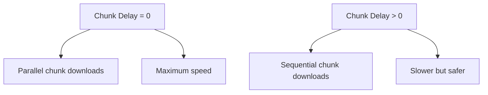

# Tidalarr Configuration Guide

## Complete Setup and Configuration Reference

---

## Quick Start Configuration

### Step 1: Install the Plugin

1. Go to **Settings > Plugins** in Lidarr
2. Click **Add Plugin Repository**
3. Paste: `https://github.com/RicherTunes/Tidalarr.git`
4. Click **Install** and restart Lidarr

### Step 2: Configure Indexer

1. Go to **Settings > Indexers > Add > Tidalarr**
2. Click **Test** to generate the OAuth Authorization URL
3. Open the URL in your browser and authorize with Tidal
4. Copy the ENTIRE redirect URL from your browser
5. Paste it into the **OAuth Redirect URL** field
6. Click **Test** again to complete authentication

### Step 3: Configure Download Client

1. Go to **Settings > Download Clients > Add > Tidalarr**
2. Set your preferred **Quality** (Lossless recommended)
3. Adjust **Max Concurrent Track Downloads** if needed (default: 2)
4. Adjust **Max Concurrent Chunk Downloads** for performance (default: 2)

---

## Indexer Configuration

### Required Settings

| Setting | Description | Default |
|---------|-------------|---------|
| **OAuth Authorization URL** | Auto-generated PKCE authorization URL | *Computed* |
| **OAuth Redirect URL** | Full redirect URL from OAuth callback | *Required* |

#### OAuth Authorization URL Field

This field is intentionally exposed to reduce setup friction:

- Automatically generated from `${ConfigPath}/pkce_state.json`
- If empty, click **Test** to generate a fresh state
- Used for browser-based authentication
- One-time display (regenerates each modal open)

**Security**: The backing `pkce_state.json` contains a PKCE `code_verifier`; never commit it or include it in logs.

#### OAuth Redirect URL

This is the critical field for completing authentication:

**Format**: `http://localhost:59027/callback/?code=...&state=...`

**How to use**:
1. Copy the ENTIRE URL from your browser after authorizing
2. Paste into the field (overwrite any existing value)
3. Click **Test** to exchange the code for tokens
4. Tokens are stored securely in Lidarr's database

**Important notes**:
- The redirect URL is **one-time use** for token exchange
- If tokens expire, paste the NEW redirect URL (no need to clear first)
- Do NOT modify the URL when pasting

### Optional Indexer Settings

| Setting | Description | Default | Range |
|---------|-------------|---------|-------|
| **API Base URL** | Tidal API endpoint | `https://api.tidal.com` | - |
| **Request Delay (ms)** | Delay between API requests | `100` | 0-5000 |
| **Enable Logging** | Detailed API logging | `false` | true/false |

#### Request Delay

Controls the delay between API requests to avoid rate limiting:

- **0**: No delay (fastest, may trigger rate limits)
- **100ms**: Default (balanced)
- **500ms+:** Conservative (for always-on systems)

**When to adjust**:
- Increase if you see 429 rate limit errors
- Decrease for faster searches (monitor for rate limits)
- Set to 0 for maximum speed (risk of rate limiting)

---

## Download Client Configuration

### Required Settings

| Setting | Description | Default |
|---------|-------------|---------|
| **Quality** | Preferred audio quality | `Lossless` |

#### Quality Options

| Quality | Bitrate | Description | When to Use |
|---------|---------|-------------|-------------|
| **Low** | ~96 kbps | AAC encoding | Testing only |
| **High** | ~320 kbps | AAC encoding | Slow connections |
| **Lossless** | ~1411 kbps | FLAC (16-bit/44.1kHz) | **Recommended** |
| **HiRes** | ~9000 kbps | FLAC (up to 24-bit/192kHz) | Maximum quality |

**Notes**:
- Not all tracks are available in all qualities
- Tidalarr automatically falls back to next available quality
- HiRes requires more bandwidth and storage

### Optional Download Settings

| Setting | Description | Default | Range |
|---------|-------------|---------|-------|
| **Chunk Delay (ms)** | Delay between chunk requests | `0` | 0-5000 |
| **Max Concurrent Track Downloads** | Parallel tracks per album | `2` | 1-3 |
| **Max Concurrent Chunk Downloads** | Parallel chunks per track | `2` | 1-8 |

#### Chunk Delay

Controls the delay between individual chunk requests:

- **0**: No delay, enables chunk parallelism (fastest)
- **>0**: Fixed delay between chunks, **disables chunk parallelism**

**How it works**:


**When to adjust**:
- **0**: Most users with stable connections
- **100-200ms**: If experiencing rate limiting
- **500ms+:** Very conservative for always-on systems

#### Max Concurrent Track Downloads

Controls how many tracks from an album download simultaneously:

| Value | Description | Use Case |
|-------|-------------|----------|
| **1** | Sequential downloads | Slow connections, stability |
| **2** | **Default** | Balanced performance |
| **3** | Maximum parallelism | Fast connections |

**Notes**:
- Each track uses its own chunk download pool
- Higher values = faster downloads but more connections
- Monitor for rate limiting when increasing

#### Max Concurrent Chunk Downloads

Controls how many chunks from a single track download simultaneously:

| Value | Description | Use Case |
|-------|-------------|----------|
| **1** | Sequential chunks | Most reliable |
| **2** | **Default** | Balanced |
| **4-8** | High parallelism | Fast connections only |

**Important**: This setting is **only effective when Chunk Delay = 0**. When Chunk Delay > 0, chunk parallelism is disabled to preserve delay semantics.

---

## Performance Tuning Guide

### Conservative Setup (Reliability)

**Best for**: Always-on systems, slow connections, avoiding rate limits

```yaml
Indexer:
  Request Delay: 500ms

Download Client:
  Quality: Lossless
  Chunk Delay: 200ms
  Max Concurrent Track Downloads: 1
  Max Concurrent Chunk Downloads: 1
```

### Balanced Setup (Default)

**Best for**: Most users

```yaml
Indexer:
  Request Delay: 100ms

Download Client:
  Quality: Lossless
  Chunk Delay: 0ms
  Max Concurrent Track Downloads: 2
  Max Concurrent Chunk Downloads: 2
```

### Aggressive Setup (Speed)

**Best for**: Fast connections, occasional use

```yaml
Indexer:
  Request Delay: 0ms

Download Client:
  Quality: HiRes
  Chunk Delay: 0ms
  Max Concurrent Track Downloads: 3
  Max Concurrent Chunk Downloads: 8
```

### Quality-Focused Setup

**Best for**: Audiophiles, maximum quality

```yaml
Indexer:
  Request Delay: 100ms

Download Client:
  Quality: HiRes
  Chunk Delay: 0ms
  Max Concurrent Track Downloads: 2
  Max Concurrent Chunk Downloads: 4
```

---

## Advanced Configuration

### Environment Variables (Optional)

Some settings can be configured via environment variables:

```bash
# API Configuration
export TIDAL_API_BASE_URL="https://api.tidal.com"
export TIDAL_CLIENT_ID="6BDSRdpK9hqEBTgU"

# Performance Tuning
export TIDAL_REQUEST_DELAY_MS="100"
export TIDAL_MAX_CONCURRENT_TRACKS="2"
export TIDAL_MAX_CONCURRENT_CHUNKS="2"
export TIDAL_CHUNK_DELAY_MS="0"

# Logging
export TIDAL_ENABLE_LOGGING="true"
```

**When to use environment variables**:
- Docker deployments: Pass via `-e` flags
- Systemd services: Add to `[Service]` section
- Testing/debugging: Temporary overrides

### HostBridge Integration (Developers)

For advanced configuration involving the HostBridge settings mapper, see the [Host Bridge Integration Guide](hostbridge-integration.md).

---

## Troubleshooting Configuration

### OAuth Authentication Issues

#### Issue: OAuth Authorization URL field is empty

**Symptoms**: The field appears blank in settings

**Solutions**:
1. Verify plugin is loaded (check `/api/v1/indexer/schema` for Tidalarr)
2. Click **Test** to generate a fresh PKCE state and URL
3. If still empty, check Lidarr logs for plugin load errors
4. Ensure ConfigPath is correctly set by saving settings first

#### Issue: "Invalid state" or authentication fails

**Symptoms**: Token exchange fails with state mismatch error

**Solutions**:
1. Click **Test** to generate a fresh OAuth Authorization URL
2. Complete the OAuth flow in your browser
3. Copy the ENTIRE redirect URL (including `code=` and `state=`)
4. Paste into **OAuth Redirect URL** field
5. Click **Test** again to exchange code for tokens

**Prevention**: Use fresh redirect URL for each authentication; don't reuse old URLs.

### Rate Limiting Issues

#### Issue: 429 errors during searches

**Symptoms**: Search failures with "Too Many Requests" error

**Solutions**:
1. Increase **Request Delay** to 200-500ms
2. Reduce **Max Concurrent Track Downloads** to 1
3. Enable **Logging** to monitor API calls

#### Issue: Slow downloads or stalls

**Symptoms**: Downloads pause or become very slow

**Solutions**:
1. Increase **Chunk Delay** to 100-200ms
2. Reduce **Max Concurrent Chunk Downloads** to 1-2
3. Reduce **Max Concurrent Track Downloads** to 1

### Quality Issues

#### Issue: Downloads not in expected quality

**Symptoms**: Requested HiRes but getting Lossless

**Explanation**: Not all tracks are available in all qualities. Tidalarr automatically falls back to the next available quality.

**Verification**: Enable **Logging** and check logs for quality detection messages.

---

## Configuration Examples

### Docker Compose

```yaml
services:
  lidarr:
    image: ghcr.io/hotio/lidarr:plugins-nightly
    environment:
      - TIDAL_REQUEST_DELAY_MS=100
      - TIDAL_MAX_CONCURRENT_TRACKS=2
      - TIDAL_MAX_CONCURRENT_CHUNKS=2
    volumes:
      - ./config:/config
      - ./plugins:/config/plugins/RicherTunes/Tidalarr
```

### Systemd Service

```ini
[Unit]
Description=Lidarr with Tidalarr
After=network.target

[Service]
Type=simple
User=lidarr
Environment="TIDAL_REQUEST_DELAY_MS=100"
Environment="TIDAL_CHUNK_DELAY_MS=0"
ExecStart=/usr/bin/lidarr -nobrowser -data=/var/lib/lidarr
Restart=on-failure
RestartSec=5s

[Install]
WantedBy=multi-user.target
```

---

## Settings Reference

### Complete Settings List

#### Indexer Settings (TidalIndexerSettings)

| Field | Type | Default | Description |
|-------|------|---------|-------------|
| `ConfigPath` | string | *Lidarr* | Lidarr config directory |
| `OAuthAuthUrl` | string | *Computed* | PKCE authorization URL |
| `OAuthRedirectUrl` | string | *Required* | OAuth callback URL |
| `ApiBaseUrl` | string | `https://api.tidal.com` | Tidal API endpoint |
| `RequestDelayMs` | int | `100` | Delay between API requests |
| `EnableLogging` | bool | `false` | Enable detailed logging |

#### Download Client Settings (TidalDownloadClientSettings)

| Field | Type | Default | Description |
|-------|------|---------|-------------|
| `Quality` | enum | `Lossless` | Preferred audio quality |
| `ChunkDelayMs` | int | `0` | Delay between chunks |
| `MaxConcurrentTrackDownloads` | int | `2` | Parallel track downloads |
| `MaxConcurrentChunkDownloads` | int | `2` | Parallel chunk downloads |

---

## See Also

- [Architecture Documentation](ARCHITECTURE.md) - System design details
- [Host Bridge Integration](hostbridge-integration.md) - Host-only settings wiring
- [README.md](../README.md) - Main project documentation
- [Lidarr.Plugin.Common](https://github.com/RicherTunes/Lidarr.Plugin.Common) - Shared library

---

**Current Version**: v1.0.1 | **Last Updated**: January 2025
